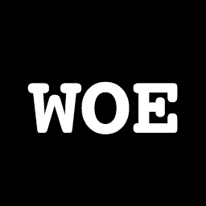

# &nbsp;woeplanet-data

> "Everything is related to everything else, but near things are more related than distant things.”
>
> &mdash;<cite>[Tobler’s First Law of Geography](https://www.geolounge.com/toblers-first-law-geography/)</cite>

Woeplanet is a gazetteer of places. Not _all_ the places in the world but a lot of them.

What's a gazetteer? It's a list of places, each with a stable, unique identifier and some descriptive metadata about that place.

## License

Crediting Woeplanet is recommended and linking back to this [License](https://github.com/woeplanet-data/woeplanet-data/blob/master/README.md) is required.

```
Data from Woeplanet. <a href="https://github.com/woeplanet-data/woeplanet-data/blob/master/LICENSE.md">License</a>
```

The Woeplanet dataset is both original work and a modification of existing open data. Some of those open data projects **do** require attribution. We have listed all sources below.

When we source other open data projects we make best effort to indicate them and we also include the original source's properties prefixed with the following names spaces:

* `gp` - [GeoPlanet](https://developer.yahoo.com/geo/geoplanet/) Where on Earth, aka `woe` (CC-BY)
* `qs` - [Quattroshapes](https://github.com/foursquare/quattroshapes/blob/master/) (CC-BY)
* `wof` - [Who's On First](https://github.com/whosonfirst-data/whosonfirst-data) (CC0/Various)

Please notify us if you believe that an open data project has not been properly noted.

Our original work is generally indicated with properties prefixed with `woe` or is not prefixed (like `name`).

Remember, some sources **require attribution**, some do not. Woeplanet's original work, including the format and structure that allows Woeplanet to operate, is made available under the [Creative Commons Zero](https://creativecommons.org/publicdomain/zero/1.0/) designation, and a shout out would be lovely.

## Sources

Woeplanet makes use of a number of open data sources, some of which **do** require attribution; please note that the data from the original sources _may_ be modified.

### Geoplanet

Properties with the `gp` prefix are from Geoplanet.

**Examples:** `gp:woeid` for Geoplanet identifiers, and `gp:aliases` for localised names.

The Geoplanet data set is licensed as follows:

```
Content licensed under Creative Commons Attribution 3.0 United States
License. Provide attribution to "Yahoo! GeoPlanet"
```

More details could be found at: http://developer.yahoo.com/geo/geoplanet/data/ but this URL now 404's. See also the last snapshot of this site at [archive.org](https://web.archive.org/web/20170810212909/http://developer.yahoo.com/geo/geoplanet/data/)

### Quattroshapes

Woeplanet doesn't always use the Quattroshapes geometry, when we do, some Quattroshapes features source from friendly CC0 or Public Domain licensed projects, and others from a stricter CC-BY project: check that in the `sources` property. This means you _may_ need to give specific credit to one or more European national mapping agencies as further described below.

Quattroshapes are licensed as follows:

```
The quattroshapes are released by foursquare under CC-BY attribution
license.

Please include attribution in your app, site, or printed work. Sample
wording: "Includes data from foursquare quattroshapes" with a link to
this Github repo; https://github.com/foursquare/quattroshapes/
```

More details can be found at: https://github.com/foursquare/quattroshapes/blob/master/LICENSE.md

Please note the following with regard to Quattroshapes features that require attribution:

#### Additional Quattroshapes Attribution

This map database contains open data from government and other sources. Consider including the following copyright statements when using the data.

#### Europe

EuroGeoGraphics data copyright is held by European National Mapping Agencies.

* Austria © Bundesamt für Eich- und Vermessungswesen
* Belgium © Institut Géographique National – Belgique
* Bulgaria © Cadastre Agency, MRDPW
* Croatia © Drzavna Geodetska Uprava
* Cyprus © Lands and Surveys, Survey and Cartogr. Br.
* Czech Republic © Ceskúrad zememerick a katastrální
* Denmark © Kort og Matrikelstyrelsen
* Estonia © Maaamet
* Faroe Islands © Kort og Matrikelstyrelsen
* Finland © Maanmittauslaitos
* France © Institut National de l’Information Géographique et Forestière – France
* Georgia © National Agency of Public Registry
* Germany © Bundesamt für Kartographie und Geodäsie
* Great Britain © Ordnance Survey
* Greece © Hellenic Military Geographical Service
* Greenland © Kort og Matrikelstyrelsen
* Hungary © Földmérési és Távérzékelési Intézet
* Iceland © Landmælingar Íslands
* Ireland © Ordnance Survey Ireland
* Italy © Istituto Geografico Militare Italiano
* Latvia © Latvijas Republikas Valsts zemes dienests
* Liechtenstein © Bundesamt für Landestopographie (Switzerland)
* Lithuania © Nacionalinė žemės tarnyba
* Luxembourg © Administration du Cadastre et de la Topographie
* Malta © Malta Environment and Planning Authority (MEPA)
* Moldova © State Agency for Land Relations and Cadastre
* Netherlands © Topografische Dienst Nederland
* Northern Ireland © Ordnance Survey of Northern Ireland
* Norway © Statens Kartverk
* Poland © Główny Urząd Geodezji i Kartografii
* Portugal © Instituto Geográfico Português
* Rep. of Slovakia © Geodetick a kartografick ústav
* Romania © CNGCFT (National Center of Geodesie, Cartography, Fotogrametry and Remote Sensing)
* Serbia © Republički geodetski zavod
* Slovenia © Geodetska Uprava Republike Slovenije
* Spain © Centro Nacional de Informacion Geografica – Instituto Geográfico Nacional
* Sweden © Lantmäteriet
* Switzerland © Bundesamt für Landestopographie
* Ukraine © Research Institute of Geodesy and Cartography

#### Additional European data

* United Kingdom: Contains Ordnance Survey data © Crown copyright and database right [2012]
* Netherlands: Kadaster
* Spain: Instituto Geográfico Nacional
* France: Institut Géographique National
* Switzerland: swisstopo
* Europe-wide: European Environment Agency (EEA) [urban morphological zones 2006](http://www.eea.europa.eu/data-and-maps/data/urban-morphological-zones-2006-umz2006-f3v0)

#### Americas

* United States: US Census Bureau (Census 2010 geography files).
* Canada: © Department of Natural Resources Canada. All rights reserved., Statistics Canada, and BC Stats
* Brazil: IBGE
* Mexico: INEGI
* Chile: Global Map of Chile © International Steering Committee for Global Mapping / Instituto Geografico Militar de Chile

#### Asia

* Indonesia: Global Map of Indonesia @ ISCGM/Indonesia
* Australian: Geoscience Australia and Australian Bureau of Statistics
* New Zealand: Land Information New Zealand
* South Africa: Global Map of the Republic of South Africa © ISCGM/State Copyright, Department of Rural Development and Land Reform, Chief Directorate of National Geo-spatial Information, Website: http://www.ngi.gov.za/
* Palestine: "Global Map of PALESTINE © ISCGM/Palestinian National Authority, Ministry of Planning. Geographic Center and Technical Support www.mop.gov.ps

### Ordnance Survey

* Contains OS data © Crown copyright and database right 2016
* Contains Royal Mail data © Royal Mail copyright and Database right 2016
* Contains National Statistics data © Crown copyright and database right 2016

### Woedb

Like Woeplanet, Woedb is built from the original Geoplanet data sources: check that in the `sources` property.

See the *Geoplanet* section above for more licensing information.

### Who's On First

Woeplanet doesn't always use the Who's On First geometry, when we do, some Who's On First features source from friendly CC0 or Public Domain licensed projects, and others from a stricter CC-BY project: check that in the `sources` property.

The Who's On First data set is licensed as follows:

```
Data from Who's On First. <a href="http://whosonfirst.mapzen.com#License">License</a>
```
More details can be found at: https://github.com/whosonfirst-data/whosonfirst-data/blob/master/LICENSE.md
